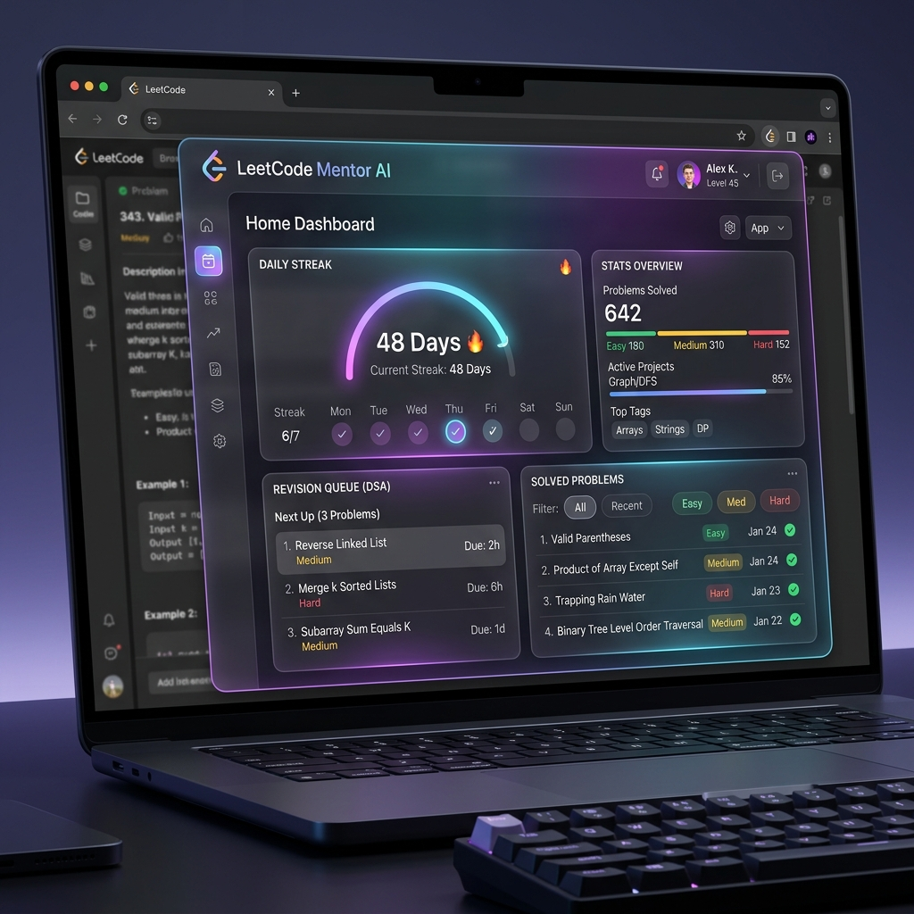
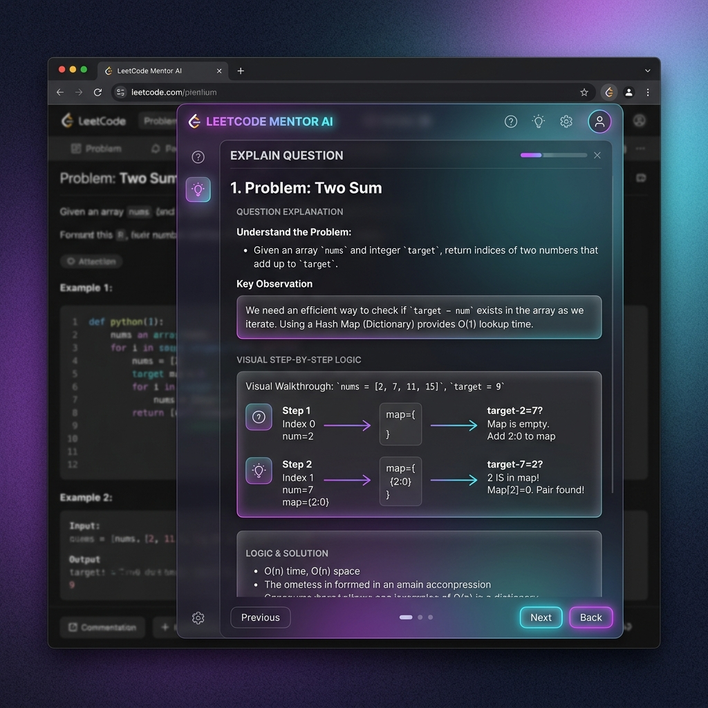
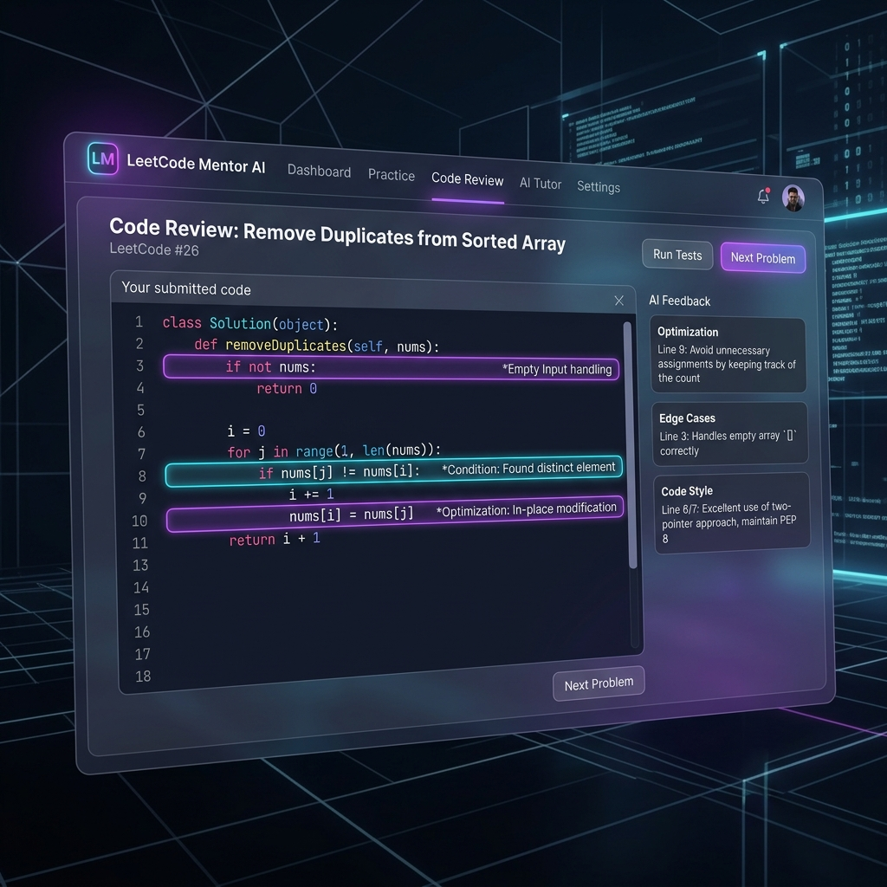
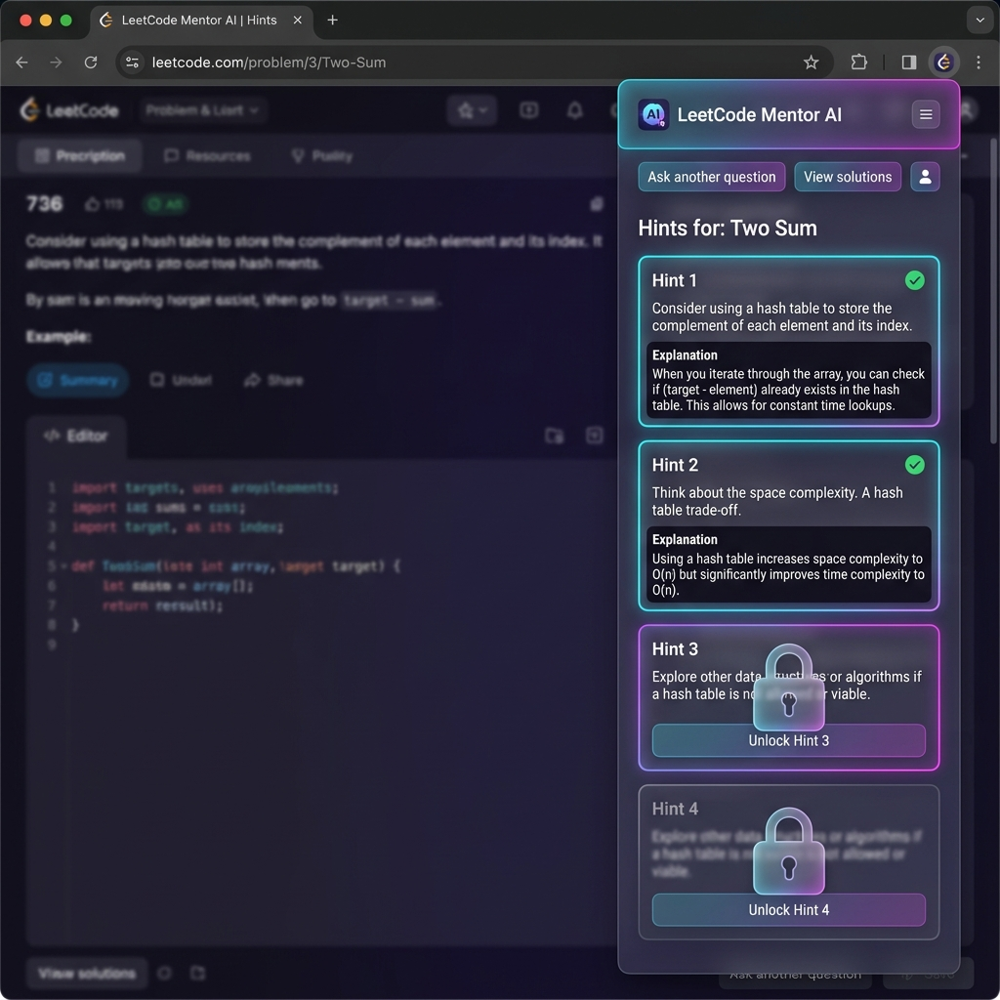
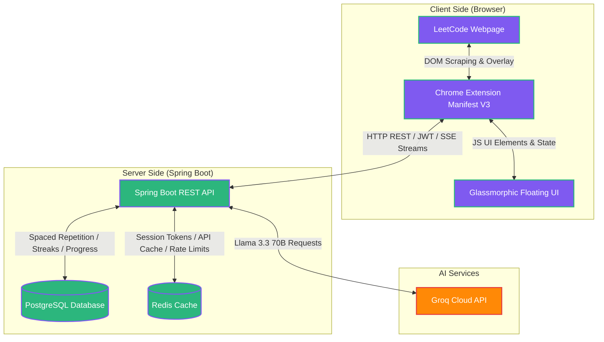
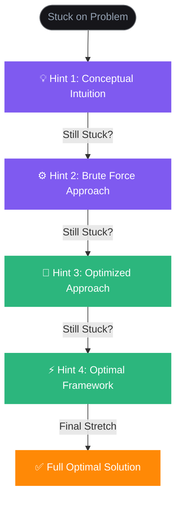

# 🚀 LeetCode Mentor AI

[](https://openjdk.org/)
[](https://spring.io/projects/spring-boot)
[](https://groq.com/)
[](https://www.postgresql.org/)
[](https://redis.io/)
[](https://developer.chrome.com/docs/extensions/mv3/intro/)
[](LICENSE)

An AI-powered Chrome Extension integrated directly into LeetCode that helps you learn Data Structures and Algorithms (DSA) **conceptually** instead of simply giving away the solutions. 

---

## 📖 Overview

**LeetCode Mentor AI** acts as a personal, interactive DSA tutor right inside your browser. Instead of spoiling questions with immediate solutions, the extension utilizes a progressive hint system powered by **Llama 3.3 70B via the Groq API** to guide you step-by-step. 

With a premium glassmorphic user interface, the system tracks your daily coding streak, schedules solved problems into a Spaced Repetition Revision Queue, provides detailed code reviews, and aggregates company-wise interview frequencies so you can prepare efficiently.

---

## ✨ Features

*   **🔍 Explain Question**: Break down complex problem statements into intuitive terms and key observations without discussing coding logic.
*   **💡 Progressive Hint System (Hint 1 → Hint 4)**: 
    *   *Hint 1*: Conceptual approach / starting intuition.
    *   *Hint 2*: Brute force approach details.
    *   *Hint 3*: Optimized approach with hints on data structures.
    *   *Hint 4*: The optimal algorithm framework.
*   **📝 AI Code Review**: Highlight structural errors, edge cases, complexity problems, and code styling enhancements in your submissions.
*   **⚡ Complexity Analysis**: Interactive complexity grids mapping time and space efficiency for different approaches.
*   **🏢 Company-wise Interview Frequency**: See real-time frequency distribution of current problems across top companies (FAANG/MAMA).
*   **⏳ Spaced Repetition Revision System**: Automatically queue solved problems for future revision at scientific intervals (1, 3, 7, 30 days) to lock in learning.
*   **🔥 Streak Tracking**: Keep yourself accountable with streak counters and daily activity logs synchronized on the backend.
*   **✅ Mark Problem as Solved**: Directly log solved status and notes into the PostgreSQL database.
*   **🎨 Glassmorphic UI**: A gorgeous, interactive floating panel designed with modern CSS glassmorphism, smooth animations, and high-readability cards.

---

## 🖼️ Screenshots

We design LeetCode Mentor AI with state-of-the-art visual excellence:

| 🏠 Home Dashboard | 🔍 Explain Question |
| :---: | :---: |
|  |  |

| 📝 AI Code Review | 💡 Progressive Hint System |
| :---: | :---: |
|  |  |

---

## 📐 Architecture Diagram

Below is the conceptual architecture showing how the Chrome extension communicates with the Spring Boot backend and various external systems.



---

## 🔄 Progressive Hint Flow

The core philosophy of LeetCode Mentor AI is active learning. The user unlocks guidance sequentially:



---

## 🔧 Environment Variables

Configure these variables inside your root `.env` file (copied from `.env.example`).

| Variable Name | Default Value | Description |
| :--- | :--- | :--- |
| `SERVER_PORT` | `9094` | The port on which the backend server runs. |
| `DB_HOST` | `postgres` | Host address for the PostgreSQL database. |
| `DB_PORT` | `5432` | Port for the PostgreSQL database. |
| `DB_NAME` | `leetcode_mentor` | Database name. |
| `DB_USERNAME` | `postgres` | Database admin username. |
| `DB_PASSWORD` | `your_password_here` | Database password. |
| `REDIS_HOST` | `redis` | Host address for the Redis database/cache. |
| `REDIS_PORT` | `6379` | Port for the Redis server. |
| `JWT_SECRET` | `dGhpcy1pcy1h...` | Base64-encoded secret key for JWT validation. |
| `JWT_ACCESS_EXPIRY` | `900000` | Expiration time for access token in ms (15 mins). |
| `JWT_REFRESH_EXPIRY` | `2592000000` | Expiration time for refresh token in ms (30 days). |
| `GROQ_API_KEY` | `your_groq_api_key` | API Key to authenticate requests with Groq Cloud. |
| `CORS_ALLOWED_ORIGINS` | `chrome-extension://...` | Allowed Chrome Extension Origin ID for CORS security. |

---

## ⚡ API Endpoints

### 🔐 Authentication (`/api/auth`)
| Method | Endpoint | Description |
| :--- | :--- | :--- |
| `POST` | `/api/auth/register` | Register a new user account. |
| `POST` | `/api/auth/login` | Log in existing user and obtain session. |
| `POST` | `/api/auth/refresh` | Invalidate current access token and issue a fresh one. |
| `POST` | `/api/auth/logout` | Clear user session cookies and revoke tokens. |

### 🤖 AI Generation & Prefetching (`/api/ai`)
| Method | Endpoint | Description |
| :--- | :--- | :--- |
| `POST` | `/api/ai/generate` | Initiates SSE stream for conceptual, hints, solution generation. |
| `POST` | `/api/ai/prefetch` | Trigger asynchronous backend background generation for all hints. |
| `GET` | `/api/ai/prefetch-status`| Fetch real-time progress of ongoing prefetch tasks. |

### 🔄 Spaced Repetition Revision (`/api/revision`)
| Method | Endpoint | Description |
| :--- | :--- | :--- |
| `GET` | `/api/revision/queue` | Retrieve current queue of problems scheduled for space-review. |
| `POST` | `/api/revision/complete`| Complete review session and schedule the next interval. |
| `GET` | `/api/revision/pending` | Fetch statistics on overdue/pending revision reviews. |

### 🔍 Code Review (`/api/review`)
| Method | Endpoint | Description |
| :--- | :--- | :--- |
| `POST` | `/api/review/code` | Submit user solution for edge-case and performance analysis. |

### 📊 Progress Tracking (`/api/progress`)
| Method | Endpoint | Description |
| :--- | :--- | :--- |
| `GET` | `/api/progress/{problemSlug}` | Get current user's hints unlocked status for the question. |
| `POST` | `/api/progress/update` | Update hint progress counts for the session. |
| `POST` | `/api/progress/solve` | Mark the problem as solved, saving to stats. |

---

## 📂 Folder Structure

```text
LeetCode-Mentor-AI/
├── assets/                     # App screenshots & assets
├── backend/                    # Spring Boot 3 Backend
│   ├── src/
│   │   ├── main/
│   │   │   ├── java/com/leetcodementor/
│   │   │   │   ├── config/      # Security, CORS, Redis & Web Configuration
│   │   │   │   ├── controller/  # REST API Controllers (Auth, AI, Revision, Progress, etc.)
│   │   │   │   ├── dto/         # Request & Response Data Transfer Objects
│   │   │   │   ├── entity/      # JPA Hibernate Database Entities
│   │   │   │   ├── enums/       # Topic, Company, Difficulty, Language enums
│   │   │   │   ├── exception/   # Custom exception models and global handlers
│   │   │   │   ├── repository/  # Spring Data JPA repositories
│   │   │   │   ├── security/    # JWT filters, User Details, token providers
│   │   │   │   └── service/     # Core Business logic, Groq LLM integration
│   │   │   └── resources/
│   │   │       ├── application.yml
│   │   │       └── logback-spring.xml
│   │   └── Dockerfile
│   └── pom.xml
├── extension/                  # Chrome Extension (Manifest V3)
│   ├── api/                    # Modularized API service wrappers
│   ├── ui/                     # UI templates (floating panel, popup)
│   ├── utils/                  # HTML Scrapers, token & storage utils
│   ├── background.js           # Chrome extension service worker
│   ├── content.js              # Injectable content script for LeetCode site UI orchestration
│   ├── manifest.json           # Extension config
│   ├── popup.html / popup.js
│   └── styles.css              # Glassmorphic custom styling sheet
├── docker-compose.yml          # Local orchestration for Redis and PostgreSQL
├── .env.example                # Example environment configurations
└── README.md                   # Project documentation
```

---

## 🛠️ Installation

Follow these steps to run the application locally on your machine:

### Prerequisites
*   Java Development Kit (JDK) 21 installed.
*   Node.js & npm (for Chrome extension testing, if any toolchains are needed).
*   Docker & Docker Compose installed.

### Step 1: Clone the Repository
```bash
git clone https://github.com/yourusername/LeetCode-Mentor-AI.git
cd LeetCode-Mentor-AI
```

### Step 2: Spin Up Infrastructure
Start the PostgreSQL and Redis containers using docker-compose:
```bash
docker-compose up -d
```

### Step 3: Configure Environment Variables
Copy `.env.example` to a new `.env` file in the root directory:
```bash
cp .env.example .env
```
Ensure you edit `.env` and supply your **Groq API Key**:
```env
GROQ_API_KEY=gsk_your_actual_groq_api_key_goes_here
```

### Step 4: Run the Backend
Navigate to the backend directory and run the Spring Boot application:
```bash
cd backend
./mvnw spring-boot:run
```

### Step 5: Install Chrome Extension
1. Open your Google Chrome browser.
2. Go to URL: `chrome://extensions/`
3. Toggle the **Developer mode** switch in the top-right corner.
4. Click on **Load unpacked** in the top-left corner.
5. Select the `extension` directory from the root of this project.

*Note: Update the extension configurations or verify the extension ID matches the CORS settings in your `.env`.*

---

## 🚀 Future Improvements

*   [ ] **🗣️ Speech-to-Text Support**: Speak your doubts directly to the mentor.
*   [ ] **📈 Advanced Performance Graphing**: Detailed dashboards for tracking concept-wise revision success rates over time.
*   [ ] **👥 Peer Revision Rooms**: Review questions and share customized progressive hints with friends in cooperative DSA rooms.
*   [ ] **🦊 Multi-Browser Compatibility**: Support Firefox and Safari browser engines.

---

## 🤝 Contributing

Contributions make the open-source community an amazing place to learn, inspire, and create. Any contributions you make are **greatly appreciated**.

1. Fork the Project.
2. Create your Feature Branch (`git checkout -b feature/AmazingFeature`).
3. Commit your Changes (`git commit -m 'Add some AmazingFeature'`).
4. Push to the Branch (`git push origin feature/AmazingFeature`).
5. Open a Pull Request.

---

## 📄 License

Distributed under the MIT License. See `LICENSE` for more information.
