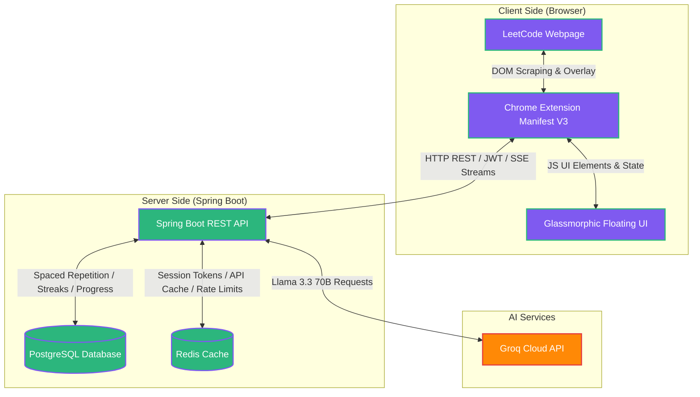

# 🚀 LeetCode AI Mentor 

### An AI-Powered Chrome Extension for Learning DSA the Right Way


LeetCode Mentor AI is designed to transform the way you practice Data Structures and Algorithms. Instead of directly revealing solutions, it guides you step-by-step using structured hints, AI-powered explanations, code reviews, and revision tracking — helping you truly understand problems rather than memorize answers.

---

## ✨ Features
```
🔍 Explain Question

Before jumping into coding, it's crucial to fully understand the problem. This feature provides:

Clear breakdown of problem statements
Key observations and constraints
Hidden patterns and insights
Intuition behind solving the problem

This ensures you start with the right mindset and approach, rather than guessing blindly.
```
---
## 💡 Progressive Hint System

```
Each problem is carefully structured into 3 different approaches, allowing you to gradually improve your thinking
from basic to optimal solutions.

Each approach contains 4 progressive hints followed by a complete solution, ensuring guided learning at every step.

✅ Approach 1 (Basic / Brute Force)

This approach focuses on building a foundational understanding.

Hint 1 → Understand the core idea and basic intuition
Hint 2 → Think about a straightforward brute force method
Hint 3 → Identify inefficiencies in this approach
Hint 4 → Refine the brute force logic step-by-step
✅ Solution → Complete brute force solution with detailed explanation and time/space complexity

✅ Approach 2 (Better / Optimized)

This stage improves upon brute force by introducing smarter techniques.

Hint 1 → Identify patterns that can optimize the brute force solution
Hint 2 → Introduce better data structures or improved logic
Hint 3 → Reduce time complexity through optimization
Hint 4 → Finalize the improved approach
✅ Solution → Optimized solution with explanation and complexity analysis

✅ Approach 3 (Optimal)

This approach focuses on achieving the most efficient solution possible.

Hint 1 → Think in terms of advanced patterns (Greedy, DP, Sliding Window, etc.)
Hint 2 → Identify key observations required for optimal performance
Hint 3 → Build the most efficient logic
Hint 4 → Refine for best possible performance
✅ Solution → Optimal solution with full explanation and complexity breakdown

This structured learning system ensures:

Deep conceptual clarity
Strong problem-solving skills
Reduced dependency on direct solutions
```
---
## 🧠 AI Code Review
```
After solving a problem, you can submit your code for AI-powered feedback.

The system analyzes your solution and provides:

Logical errors and potential bugs
Edge case handling suggestions
Time and space complexity improvements
Optimization opportunities
Code readability and structure feedback

This helps you learn from your mistakes and improve continuously.
```
---
## 🔄 Revision System
```
To ensure long-term retention, the extension includes a revision system based on spaced repetition.

You can revisit problems at key intervals:

Day 3 → Reinforce initial understanding
Day 7 → Strengthen memory and recall

This approach helps in:

Retaining concepts longer
Improving recall speed during interviews
Building confidence in problem-solving
```
---

## 🏢 Company Frequency Analysis
```
Understand the real-world importance of each problem by analyzing:

Companies that frequently ask the question
Interview frequency trends
Priority level for preparation
Common patterns used in interviews

This helps you focus on high-impact problems.
```
---

## 📈 User Progress Tracking
```
Track your learning journey with detailed analytics:

Total solved questions
Revision history
Daily streak tracking
Hint usage progress
Overall learning statistics

This keeps you motivated and consistent.
```
---

## 🖼️ Screenshots

We design LeetCode Mentor AI with state-of-the-art visual excellence:

| 🏠 Home Dashboard | 🔍 Explain Question |
| :---: | :---: |
|  |  |

| 📝 AI Code Review | 💡 Progressive Hint System |
| :---: | :---: |
|  |  |

---

## 📐 Architecture Diagram

Below is the conceptual architecture showing how the Chrome extension communicates with the Spring Boot backend and various external systems.



---
## 🛠 Tech Stack

### Frontend
```
Chrome Extension (Manifest V3)
HTML, CSS, JavaScript
Lightweight and responsive UI
```
### Backend
```
Java 21
Spring Boot 3
Spring Security
Spring Data JPA
RESTful APIs
```
### Database
```
PostgreSQL (for persistent user data)
```
### Cache
```
Redis (for fast AI response caching)
```
### AI Providers
```
Groq
Model: llama-3.3-70b-versatile (Primary)
Gemini
Model: gemini-2.5-flash (Fallback)
```
### Deployment
```
AWS EC2 (Backend hosting)
Upstash Redis (Cloud caching)
Neon PostgreSQL (Managed database)
```
---
## 🔐 Authentication
```
The application ensures secure access using:

JWT Access Tokens for authentication
Refresh Tokens for session management
Persistent login support
Spring Security integration
BCrypt password encryption for safety
```
---

## 🔧 Environment Variables
```
SERVER_PORT=
DB_HOST=
DB_PORT=
DB_NAME=
DB_USERNAME=
DB_PASSWORD=
REDIS_HOST=
REDIS_PORT=
REDIS_USERNAME=
REDIS_PASSWORD=
JWT_SECRET=
GROQ_API_KEY=
GEMINI_API_KEY=
```
---

## ⚡ API Endpoints

### 🔐 Authentication (`/api/auth`)
| Method | Endpoint | Description |
| :--- | :--- | :--- |
| `POST` | `/api/auth/register` | Register a new user account. |
| `POST` | `/api/auth/login` | Log in existing user and obtain session. |
| `POST` | `/api/auth/refresh` | Invalidate current access token and issue a fresh one. |
| `POST` | `/api/auth/logout` | Clear user session cookies and revoke tokens. |

### 🤖 AI Generation & Prefetching (`/api/ai`)
| Method | Endpoint | Description |
| :--- | :--- | :--- |
| `POST` | `/api/ai/generate` | Retreive cached suggestion or status (SUCCESS/PENDING/FAILED) for polling. |
| `POST` | `/api/ai/prefetch` | Trigger asynchronous backend background generation for all hints. |
| `GET` | `/api/ai/prefetch-status`| Fetch real-time progress of ongoing prefetch tasks. |

### 🔄 Spaced Repetition Revision (`/api/revision`)
| Method | Endpoint | Description |
| :--- | :--- | :--- |
| `GET` | `/api/revision/queue` | Retrieve current queue of problems scheduled for space-review. |
| `POST` | `/api/revision/complete`| Complete review session and schedule the next interval. |
| `GET` | `/api/revision/pending` | Fetch statistics on overdue/pending revision reviews. |

### 🔍 Code Review (`/api/review`)
| Method | Endpoint | Description |
| :--- | :--- | :--- |
| `POST` | `/api/review/code` | Submit user solution for edge-case and performance analysis. |

### 📊 Progress Tracking (`/api/progress`)
| Method | Endpoint | Description |
| :--- | :--- | :--- |
| `GET` | `/api/progress/{problemSlug}` | Get current user's hints unlocked status for the question. |
| `POST` | `/api/progress/update` | Update hint progress counts for the session. |
| `POST` | `/api/progress/solve` | Mark the problem as solved, saving to stats. |

---

## 📂 Folder Structure

```text
LeetCode-Mentor-AI/
├── assets/                     # App screenshots & assets
├── backend/                    # Spring Boot 3 Backend
│   ├── src/
│   │   ├── main/
│   │   │   ├── java/com/leetcodementor/
│   │   │   │   ├── config/      # Security, CORS, Redis & Web Configuration
│   │   │   │   ├── controller/  # REST API Controllers (Auth, AI, Revision, Progress, etc.)
│   │   │   │   ├── dto/         # Request & Response Data Transfer Objects
│   │   │   │   ├── entity/      # JPA Hibernate Database Entities
│   │   │   │   ├── enums/       # Topic, Company, Difficulty, Language enums
│   │   │   │   ├── exception/   # Custom exception models and global handlers
│   │   │   │   ├── repository/  # Spring Data JPA repositories
│   │   │   │   ├── security/    # JWT filters, User Details, token providers
│   │   │   │   └── service/     # Core Business logic, Groq LLM integration
│   │   │   └── resources/
│   │   │       ├── application.yml
│   │   │       └── logback-spring.xml
│   │   └── Dockerfile
│   └── pom.xml
├── extension/                  # Chrome Extension (Manifest V3)
│   ├── api/                    # Modularized API service wrappers
│   ├── ui/                     # UI templates (floating panel, popup)
│   ├── utils/                  # HTML Scrapers, token & storage utils
│   ├── background.js           # Chrome extension service worker
│   ├── content.js              # Injectable content script for LeetCode site UI orchestration
│   ├── manifest.json           # Extension config
│   ├── popup.html / popup.js
│   └── styles.css              # Glassmorphic custom styling sheet
├── docker-compose.yml          # Local orchestration for Redis and PostgreSQL
├── .env.example                # Example environment configurations
└── README.md                   # Project documentation
```

---

## 🛠️ Installation

Follow these steps to run the application locally on your machine:

### Prerequisites
*   Java Development Kit (JDK) 21 installed.
*   Node.js & npm (for Chrome extension testing, if any toolchains are needed).
*   Docker & Docker Compose installed.

### Step 1: Clone the Repository
```bash
git clone https://github.com/yourusername/LeetCode-Mentor-AI.git
cd LeetCode-Mentor-AI
```

### Step 2: Spin Up Infrastructure
Start the PostgreSQL and Redis containers using docker-compose:
```bash
docker-compose up -d
```

### Step 3: Configure Environment Variables
Copy `.env.example` to a new `.env` file in the root directory:
```bash
cp .env.example .env
```
Ensure you edit `.env` and supply your **Groq API Key**:
```env
GROQ_API_KEY=gsk_your_actual_groq_api_key_goes_here
```

### Step 4: Run the Backend
Navigate to the backend directory and run the Spring Boot application:
```bash
cd backend
./mvnw spring-boot:run
```

### Step 5: Install Chrome Extension
1. Open your Google Chrome browser.
2. Go to URL: `chrome://extensions/`
3. Toggle the **Developer mode** switch in the top-right corner.
4. Click on **Load unpacked** in the top-left corner.
5. Select the `extension` directory from the root of this project.

*Note: Update the extension configurations or verify the extension ID matches the CORS settings in your `.env`.*

---

## 🚀 Future Improvements

*   [ ] **🗣️ Speech-to-Text Support**: Speak your doubts directly to the mentor.
*   [ ] **📈 Advanced Performance Graphing**: Detailed dashboards for tracking concept-wise revision success rates over time.
*   [ ] **👥 Peer Revision Rooms**: Review questions and share customized progressive hints with friends in cooperative DSA rooms.
*   [ ] **🦊 Multi-Browser Compatibility**: Support Firefox and Safari browser engines.

---


## 📄 License

Distributed under the MIT License. See `LICENSE` for more information.
